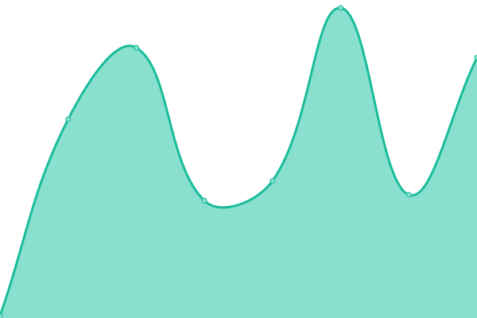
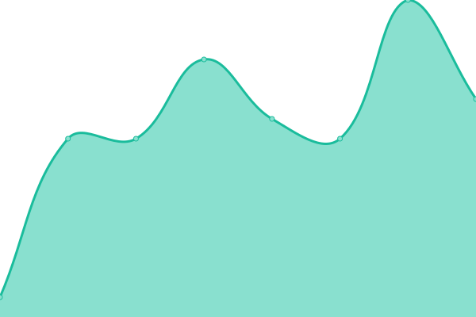
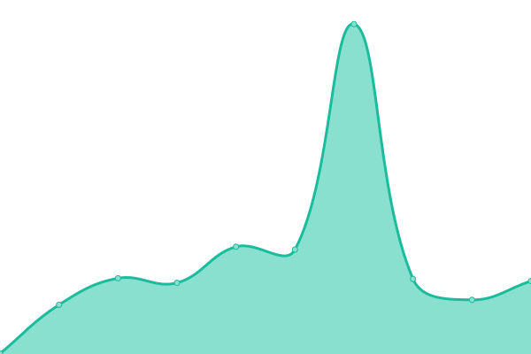
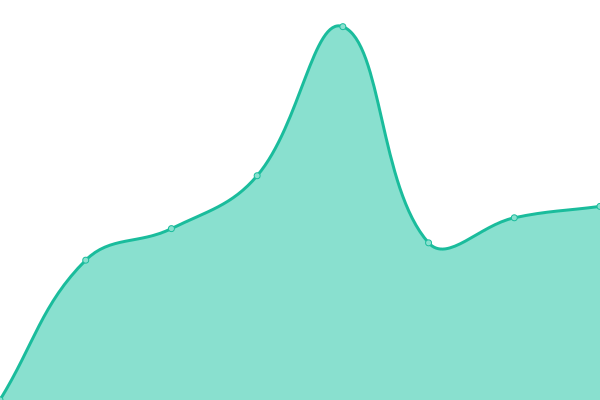
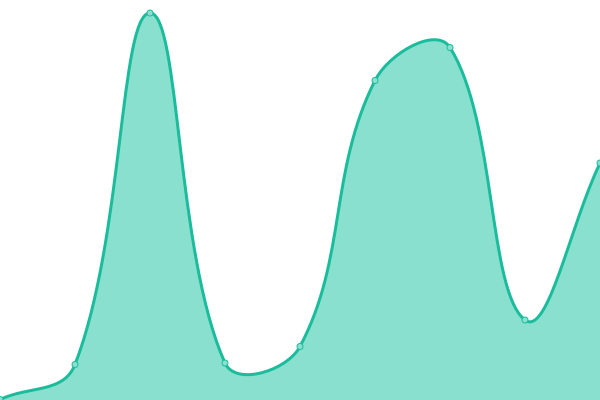

# [📈 Estado en vivo](https://radar.takkini.eu.org): <!--live status--> **🟧 Partial outage**

Bienvenidos al monitor de actividad y la página de estado de [TeroRERO](http://www.devinconde.com), Basado en [Upptime](https://github.com/upptime/upptime).

With [Upptime](https://upptime.js.org), you can get your own unlimited and free uptime monitor and status page, powered entirely by a GitHub repository. We use [Issues](https://github.com/terorero/monitor/issues) as incident reports, [Actions](https://github.com/terorero/monitor/actions) as uptime monitors, and [Pages](https://radar.takkini.eu.org) for the status page.

<!--start: status pages-->
<!-- This summary is generated by Upptime (https://github.com/upptime/upptime) -->
<!-- Do not edit this manually, your changes will be overwritten -->
<!-- prettier-ignore -->
| URL | Status | History | Response Time | Uptime |
| --- | ------ | ------- | ------------- | ------ |
|  [La Razón](https://www.la-razon.com) | 🟩 Up | [la-razon.yml](https://github.com/terorero/monitor/commits/HEAD/history/la-razon.yml) | 

 171ms
     
 | 

<a href="https://radar.takkini.eu.org/history/la-razon">100.00%</a>
    

|  [Login LR](https://www.la-razon.com/login) | 🟩 Up | [login-lr.yml](https://github.com/terorero/monitor/commits/HEAD/history/login-lr.yml) | 

 505ms
     
 | 

<a href="https://radar.takkini.eu.org/history/login-lr">100.00%</a>
    

|  [El Loro de Oro](https://lorodeoro.la-razon.com) | 🟩 Up | [el-loro-de-oro.yml](https://github.com/terorero/monitor/commits/HEAD/history/el-loro-de-oro.yml) | 

 726ms
     
 | 

<a href="https://radar.takkini.eu.org/history/el-loro-de-oro">100.00%</a>
    

|  [El Loro de Oro (ADMIN)](https://pa-admin.la-razon.com) | 🟩 Up | [el-loro-de-oro-admin.yml](https://github.com/terorero/monitor/commits/HEAD/history/el-loro-de-oro-admin.yml) | 

 705ms
     
 | 

<a href="https://radar.takkini.eu.org/history/el-loro-de-oro-admin">100.00%</a>
    

|  [Storage TT](https://storage.soporte.eu.org) | 🟥 Down | [storage-tt.yml](https://github.com/terorero/monitor/commits/HEAD/history/storage-tt.yml) | 

 638ms
     
 | 

<a href="https://radar.takkini.eu.org/history/storage-tt">66.15%</a>
    

|  [TransTurin Website](https://www.transturin.com) | 🟩 Up | [trans-turin-website.yml](https://github.com/terorero/monitor/commits/HEAD/history/trans-turin-website.yml) | 

 2385ms
     
 | 

<a href="https://radar.takkini.eu.org/history/trans-turin-website">100.00%</a>
    

|  [Titicaca Catamarans](https://titicacacatamarans.com) | 🟩 Up | [titicaca-catamarans.yml](https://github.com/terorero/monitor/commits/HEAD/history/titicaca-catamarans.yml) | 

 726ms
     
 | 

<a href="https://radar.takkini.eu.org/history/titicaca-catamarans">100.00%</a>
    

|  [Ventas Inmediatas](https://ventasinmediatas.transturin.com) | 🟩 Up | [ventas-inmediatas.yml](https://github.com/terorero/monitor/commits/HEAD/history/ventas-inmediatas.yml) | 

 603ms
     
 | 

<a href="https://radar.takkini.eu.org/history/ventas-inmediatas">100.00%</a>
    

<!--end: status pages-->

[**Visite nuestro monitor web →**](https://radar.takkini.eu.org)

## 📄 License

- Powered by: [Upptime](https://github.com/upptime/upptime)
- Code: [MIT](./LICENSE) © [TeroRERO](http://www.devinconde.com)
- Data in the `./history` directory: [Open Database License](https://opendatacommons.org/licenses/odbl/1-0/)
