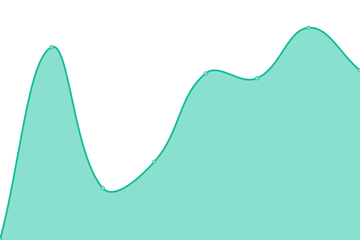

# [📈 Live Status](https://radar.takkini.eu.org): <!--live status--> **🟧 Partial outage**

This repository contains the open-source uptime monitor and status page for [TeroRERO](http://www.devinconde.com), powered by [Upptime](https://github.com/upptime/upptime).

With [Upptime](https://upptime.js.org), you can get your own unlimited and free uptime monitor and status page, powered entirely by a GitHub repository. We use [Issues](https://github.com/terorero/monitor/issues) as incident reports, [Actions](https://github.com/terorero/monitor/actions) as uptime monitors, and [Pages](https://radar.takkini.eu.org) for the status page.

<!--start: status pages-->
<!-- This summary is generated by Upptime (https://github.com/upptime/upptime) -->
<!-- Do not edit this manually, your changes will be overwritten -->
<!-- prettier-ignore -->
| URL | Status | History | Response Time | Uptime |
| --- | ------ | ------- | ------------- | ------ |
|  [La Razón](https://www.la-razon.com) | 🟩 Up | [la-razon.yml](https://github.com/terorero/monitor/commits/HEAD/history/la-razon.yml) | 

 274ms
     
 | 

<a href="https://radar.takkini.eu.org/history/la-razon">100.00%</a>
    

|  [Login LR](https://www.la-razon.com/login) | 🟩 Up | [login-lr.yml](https://github.com/terorero/monitor/commits/HEAD/history/login-lr.yml) | 

 316ms
     
 | 

<a href="https://radar.takkini.eu.org/history/login-lr">99.48%</a>
    

|  [El Loro de Oro](https://lorodeoro.la-razon.com) | 🟩 Up | [el-loro-de-oro.yml](https://github.com/terorero/monitor/commits/HEAD/history/el-loro-de-oro.yml) | 

 1899ms
     
 | 

<a href="https://radar.takkini.eu.org/history/el-loro-de-oro">100.00%</a>
    

|  [El Loro de Oro (ADMIN)](https://pa-admin.la-razon.com) | 🟩 Up | [el-loro-de-oro-admin.yml](https://github.com/terorero/monitor/commits/HEAD/history/el-loro-de-oro-admin.yml) | 

 718ms
     
 | 

<a href="https://radar.takkini.eu.org/history/el-loro-de-oro-admin">100.00%</a>
    

|  [LR Store](https://la-razon.ventas.com.bo) | 🟩 Up | [lr-store.yml](https://github.com/terorero/monitor/commits/HEAD/history/lr-store.yml) | 

 1110ms
     
 | 

<a href="https://radar.takkini.eu.org/history/lr-store">100.00%</a>
    

|  [LR Game](https://game.la-razon.com) | 🟩 Up | [lr-game.yml](https://github.com/terorero/monitor/commits/HEAD/history/lr-game.yml) | 

 1184ms
     
 | 

<a href="https://radar.takkini.eu.org/history/lr-game">100.00%</a>
    

|  [NOVALABSRL 22](https://www.novalabsrl.com) | 🟥 Down | [novalabsrl-22.yml](https://github.com/terorero/monitor/commits/HEAD/history/novalabsrl-22.yml) | 

 0ms
     
 | 

<a href="https://radar.takkini.eu.org/history/novalabsrl-22">0.00%</a>
    

<!--end: status pages-->

[**Visit our status website →**](https://radar.takkini.eu.org)

## 📄 License

- Powered by: [Upptime](https://github.com/upptime/upptime)
- Code: [MIT](./LICENSE) © [TeroRERO](http://www.devinconde.com)
- Data in the `./history` directory: [Open Database License](https://opendatacommons.org/licenses/odbl/1-0/)
